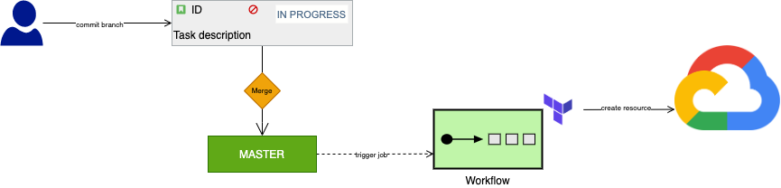

# gcp-bootstrap

This project contains the Terraform template needed to build the atlasSource infrastructure and the CI to update/modify it automatically.

## Overview:

the project contains several distinct contents that must be applied separately according to specific order.

### [1 - Makefile](./Makefile)
For a new project, perform a manual step using Makefile that validates the prerequisite and creates and configures the bucket to store the Terraform state remotely.
If the project has already been created and the terraform bucket is already created, then skip the first step and configure your terraform backend with the existing bucket.

- How to use the `Makefile`
  - check the prerequiste
  ```bash
  END_USER_EMAIL=dummy@example.com ORGANIZATION_ID=my_orga_id BILLING_ACCOUNT_ID=my_billing_acc_id make start
  ```
    this command checks if you have the necessary tools for the setup, then it connects to GCP and executes commands to check if the user has the necessary rights to execute the next steps

  - Set up a new stage
  ```bash
  ENV=stage Make prepare
  ```
    this command checks if a bucket already exists for the Terraform remote backend and if it does not exist it creates it

### [2 - Modules](./modules)

This Break down complex Terraform configurations into reusable modules to make it easier to manage and maintain.
This folder content a set of terraform configuration files, this structure is intended to make it easier to navigate, understand and update your configuration by grouping related parts of our configuration.
each Sub-Directory consists of a resource that we use in your infrastructure, a resource that is a service or a set of services grouped together, such as vpc + subnets + route table.

- overview of the module structure

for each Sub-module there is documentation written in the module readme
```
gcp-bootstrap/
└── modules
    ├── cloud-function
    ├── cloud-run
    ├── iam
    ├── project
    └── network-fabric
       ├── dns
       ├── vpc
       ├── subnets
       ├── routes
       ├── firewall-rules
       ├── loadbalancer
       ├── network-peering
       └── private-service-connect
```

### [3 - environments](./environments)

This folders refers to a set of resources that are defined and managed together as a single unit for a specific stage e.g.(dev, prod, etc..)
These resources include things like DNS, PubSub, GCP Project and other infrastructure components that make up a complete system.

```
gcp-bootstrap/
└── environments
    ├── dev
    └── prod
```

# CICD
Creating an infrastructure stack using Terraform typically involves writing Terraform configuration files that define the desired
state of the stack and its resources. These configuration files can be used to create, update, or destroy the stack and its resources, depending on the desired action.

To create a new infrastructure stack using Terraform, you typically use the ```terraform apply``` command. 
This command reads the configuration files in your working directory and creates or updates the resources described in those files to match their desired state.

To destroy the infrastructure stack, use the ```terraform destroy``` command. This command will delete all the resources created by Terraform.

It's important to note that Terraform is a powerful tool, it allows to manage your infrastructure as code, so you can version control it, automate and test your deployments.

CI best practice:
- **Version control**: to Keep all Terraform configuration files in a version control system, such as Git, to track changes and rollback if necessary.
- **Plan before applying**: Use the terraform plan command to preview the changes that will be made before actually applying them.
- **Use state file**: Use remote state file storage for team collaboration and keeping track of the state of your infrastructure.
- **Use Terraform variables**: Use variables to make your code more flexible and easier to reuse across different environments.
- **Use provisioners**: Use provisioners to automate tasks that need to be performed after Terraform creates the infrastructure.
- **Test your Terraform code**: Use automated testing tools whenever possible to test your Terraform code, especially when working in a team.
- **Stay up-to-date**: Keep your version of Terraform and all modules up-to-date to ensure that you have access to the latest features and bug fixes.
- **Deploy using pipeline**: By automating the deployment process, teams can quickly roll back changes in case of issues.


